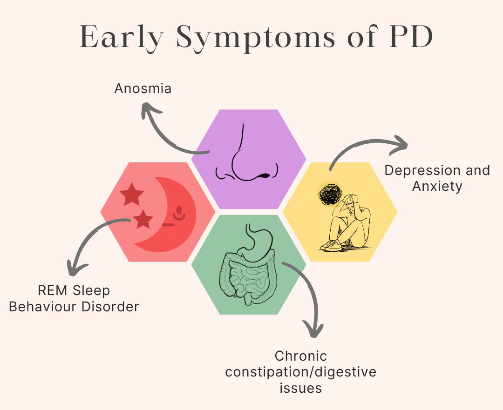
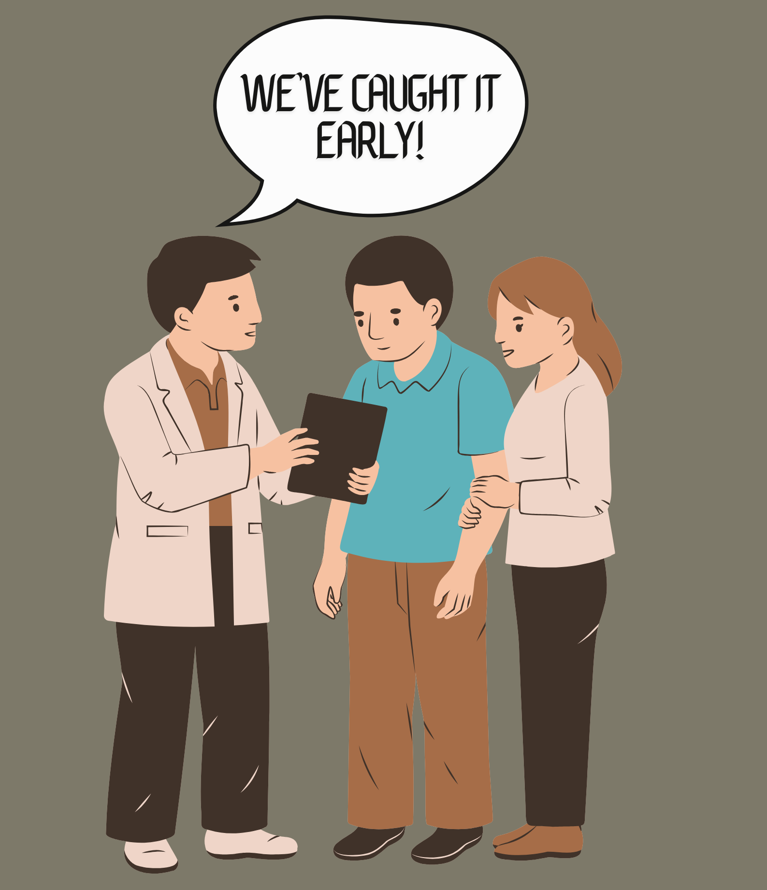

 
# The Earliest Signs of Parkinson’s (That No One Talks About)
Date: 2025-07-02
## Parkinson’s Whispers Before It Shouts
---

When you think of Parkinson’s disease, the first thing that probably comes to mind is a tremor — that characteristic shaking of the hands.

But what if I told you that some of the first signs of Parkinson’s show up **years before a single hand shakes**?

Welcome to the world of **prodromal Parkinson’s** — the stage where symptoms are subtle, confusing, and often completely overlooked, even by doctors.

---

## Early Clues You Might Miss

Parkinson’s doesn’t come out of nowhere. It builds quietly. Here are some of the most well-documented non-motor symptoms that can appear long before the classic motor ones:

### Loss of Smell (*Anosmia*)

* Often the earliest sign
* Up to **90%** of people with Parkinson’s report a significantly reduced sense of smell
* It can show up **10–20 years** before diagnosis

### Chronic Constipation

* Not just a digestive issue — it reflects **autonomic nervous system dysfunction**
* Seen in over **60%** of PD patients, often **decades** before motor symptoms

### REM Sleep Behaviour Disorder (*RBD*)

* People act out dreams by **kicking**, **yelling**, or **punching** in their sleep
* A strong predictor of neurodegenerative diseases like Parkinson’s or Lewy body dementia
* Up to **80%** of people with RBD go on to develop a neurodegenerative condition

### Mood Changes (*Depression & Anxiety*)

* Not just reactions to having Parkinson’s — these can be caused by **dopamine imbalance** in the brain
* Depression can appear **years before** any physical symptoms

### Micrographia & Speech Changes

* Handwriting gets **small and cramped**
* Speech may become **soft**, **monotone**, or **slower**
* Easy to overlook — but neurologically significant

  <figure style="text-align: center;">
  
  <figcaption style="font-size: 0.9em; font-family: 'Handlee', cursive; margin-top: 8px;">
   Parksinson's can start quietly.
  </figcaption>
</figure>

---

## Why This Matters

**Early detection = earlier intervention**

While there’s no cure yet, recognizing the prodromal phase can help:

* **Delay progression** with lifestyle changes, exercise, and early medications
* **Open the door** to clinical trials and experimental therapies
* **Give people answers** and reduce years of misdiagnosis

> *Imagine a future where we don’t wait for tremors to start treatment —
> We act before the brain loses too much dopamine.*

That future starts with **awareness**.

<figure style="text-align: center;">
  
  <figcaption style="font-size: 0.9em; font-family: 'Handlee', cursive; margin-top: 8px;">
    Spot it early. Treat it better. Parksinson's doesn't wait and neither should we.
  </figcaption>
</figure>

---

##  What Researchers Are Exploring

Scientists are developing tools to catch Parkinson’s early:

* [Olfactory tests](https://www.ncbi.nlm.nih.gov/pmc/articles/PMC2731071/) (smell tests for diagnostic screening)
* [Sleep studies](https://www.ncbi.nlm.nih.gov/pmc/articles/PMC4876140/) to track REM behaviour disorder
* [Biomarkers](https://www.ncbi.nlm.nih.gov/pmc/articles/PMC9052890/) in cerebrospinal fluid and blood
* Imaging techniques like [DaTscan](https://www.ncbi.nlm.nih.gov/pmc/articles/PMC4209327/) to track dopamine transport

One day, a combination of these might become a **standard Parkinson’s risk panel**, just like blood pressure or cholesterol checks.

---

##  Final Thoughts

Parkinson’s isn’t just about tremors. It’s a disease that starts silently and grows over time.

The more we talk about these early signs, the more people we can help identify the disease before it takes over.

So let’s **talk about smell loss**.
Let’s **talk about sleep disturbances**.
Let’s **talk about depression**.

> Because what we ignore today might be what saves someone tomorrow.

**— Krithika Rajesh 🧠**

