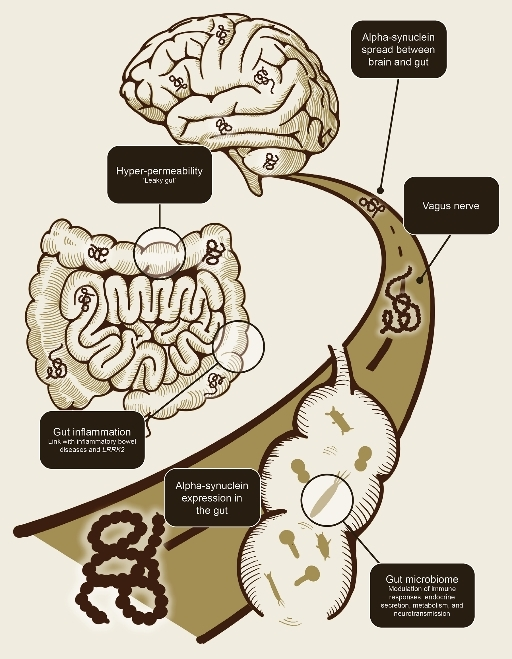

 
# Parkinson’s and the Gut — The Weirdest, Realest Connection
Date: 2025-07-15
## How your gut microbes might influence brain cells, dopamine, and the onset of Parkinson’s.
---

When we think about Parkinson’s disease, we usually zoom in on the brain: dopamine, tremors, and that wobbly, uncooperative walk. But a growing body of research says:

Parkinson’s might actually start in your gut! 
      
Yes. The same place you digest your fries and question your dairy tolerance might be the earliest battleground in this brain disease.

## The Gut-Brain Axis: A Real Thing
Your gut and brain constantly talk to each other through the gut-brain axis. This includes:

* **The vagus nerve** — like a direct phone line from your intestines to your brainstem
* **The immune system** — inflammation in the gut can trigger responses in the brain
* **Microbiota metabolites** — gut bacteria produce chemicals (like SCFAs and tryptophan metabolites) that affect brain health

<Figure style="text-align: center;">

<figcaption> The gut and brain communicate through nerves, immunity, and microbiota. </figcaption>
</figure>

This two-way system is so powerful, some scientists now refer to the gut as the [*"second brain."*](https://pmc.ncbi.nlm.nih.gov/articles/PMC4798912/)

## 🔬 What Happens in Parkinson’s?
Long before a tremor, a patient might experience:

* **Chronic constipation**
* **Bloating**
* **Gastrointestinal pain**
* **REM Sleep Behaviour Disorder (RBD)**
  
And these aren’t just inconvenient symptoms— **they’re early warning signs.**

One [study](https://www.nature.com/articles/s41531-025-00894-4) showed that people who develop Parkinson’s often had gut-related issues 10–20 years earlier. Wild, right?

## The Alpha-Synuclein Mystery
The real villain here is **alpha-synuclein**, a protein that normally helps neurons communicate. But when it **misfolds**, it clumps into toxic structures called **Lewy bodies**, a hallmark of Parkinson’s [(previous post explains all about these Lewy Bodies).](https://krithikarajesh.github.io/BenchToBrain.github.io/posts/view.html?post=next.md)

Now here’s where things get crazy:

* Researchers have found **misfolded alpha-synuclein in the gut** of Parkinson’s patients *years* before it's detected in the brain.
* These misfolded proteins may **travel up the vagus nerve** from the gut to the brain, spreading their chaos.

 <Figure style="text-align: center;">

<figcaption>
<a href="https://neurotorium.org/the-microbiome-gut-brain-axis-in-parkinsons-disease/" target="_blank">
    Alpha-synuclein might travel from the gut to the brain—linking gut health to Parkinson’s.
    </a>
</figcaption>
</figure>

This process is called **prion-like propagation**, like passing bad code from one neuron to the next.
In fact, a Danish [study](https://pmc.ncbi.nlm.nih.gov/articles/PMC5501039/#:~:text=The%20risk%20of%20developing%20PD,rather%20than%20via%20the%20bloodstream.) found that people who had undergone a **vagotomy** (surgical severing of the vagus nerve) had a significantly reduced risk of developing Parkinson’s.

## Role of Gut Microbiota
Your gut is home to trillions of microbes, and they do **so much** more than help digest food. In Parkinson’s:

* Microbial diversity is often **reduced**
* Some bacteria overproduce **pro-inflammatory molecules**
* Others **lower dopamine availability** or produce neurotoxins

<Figure style="text-align: center;">

<figcaption> Your gut microbes might have more to do with Parkinson’s than we ever expected. </figcaption>
</figure>

Emerging [research](https://www.sciencedirect.com/science/article/abs/pii/S0306452225007651) even shows that changing gut flora in animal models can **trigger or prevent Parkinsonian symptoms.** That’s... crazy.

## Where the Research Is Headed
Scientists are starting to explore:

* [**Gut biomarkers**](https://pmc.ncbi.nlm.nih.gov/articles/PMC11513973/) (like specific alpha-synuclein strains in stool or gut biopsies)
* [**Probiotic**](https://www.sciencedirect.com/science/article/pii/S0965229924000335) **and** [**prebiotic**](https://www.nature.com/articles/s41531-025-00885-5) **therapies**]
* [**Dietary interventions**](https://pmc.ncbi.nlm.nih.gov/articles/PMC10836553/) (Mediterranean-style diets seem protective)
* [**Anti-inflammatory compounds**](https://www.sciencedirect.com/science/article/pii/S1568163722000605) targeting the enteric nervous system
* [**Faecal microbiota transplantation**](https://pmc.ncbi.nlm.nih.gov/articles/PMC10019775/) (yes, poop transplants—real science!)
  
We’re entering an era where the **gut may become the key to diagnosing and even treating Parkinson’s** before it reaches the brain.

## Why It Matters
* Your gut is not just a digestive tube—it's a neuroimmune powerhouse
* Early signs of Parkinson’s often start there
* By studying the gut, we might unlock **earlier detection, better prevention, and new therapeutic approaches**
  
And honestly? That’s kind of amazing.

-**Krithika Rajesh 🧠**
