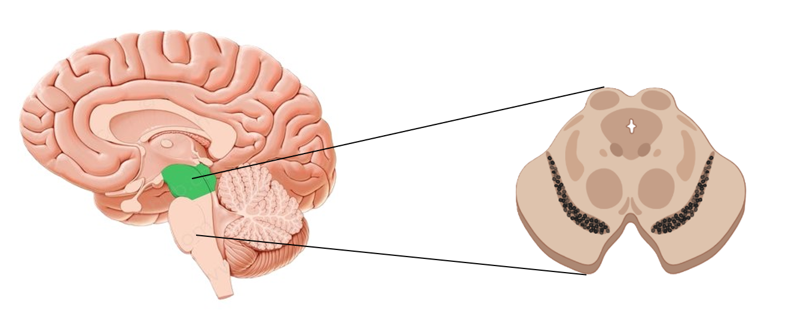
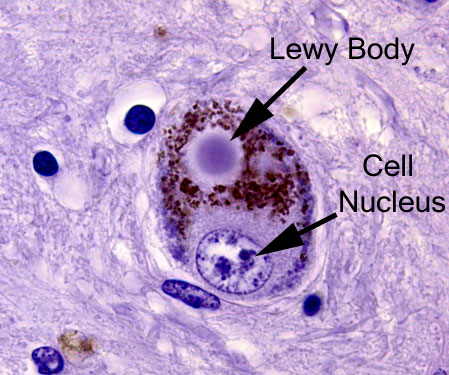
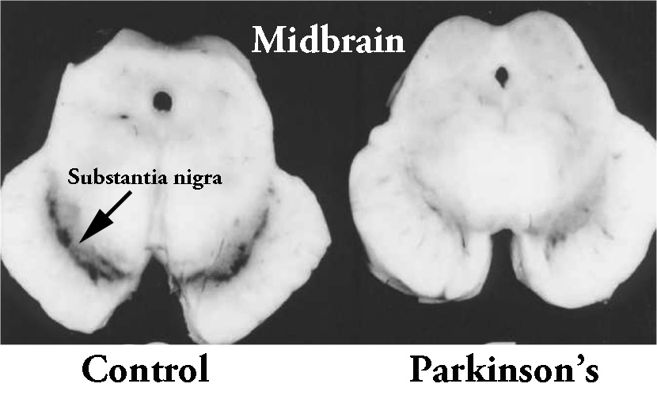
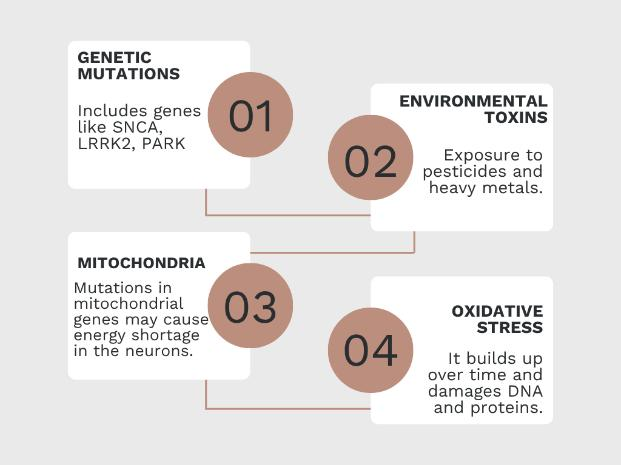

 
# What’s Going On In The Brain During Parkinson’s?
Date: 2025-07-09
## *Understanding the storm in the brain*
---

We’ve already discussed what happens physically to someone with Parkinson’s. But *underneath all that*? There's a storm happening in the brain.
Let’s zoom in, shall we? 

## The Star of the Show: Dopamine

Dopamine is a chemical messenger in the brain that helps control movement, mood, and even motivation. Think of it as your brain’s “smooth operator.”
In Parkinson’s, dopamine starts to disappear — specifically in a tiny region called the substantia nigra, deep within the midbrain.

<Figure style="text-align: center;">

<figcaption> Spotlight on the Substantia Nigra 🔦</figcaption>
</figure>

## What Exactly Happens?
**1. Neuron Death in the Substantia Nigra**
This area is responsible for producing dopamine.
In Parkinson’s, the neurons here start to die off slowly, progressively, and for reasons we still don’t fully understand.
By the time symptoms show up, around [60–80% of these neurons may already be gone.](https://pmc.ncbi.nlm.nih.gov/articles/PMC2918373/#R26)
As these neurons die, they leave behind pigment called **neuromelanin**, kind of like soot after a fire. It's a byproduct of dopamine metabolism and gives the substantia nigra its dark colour. In Parkinson’s, this dark region fades as neurons vanish.

 <Figure style="text-align: center;">

<figcaption>
<a href="https://scienceofparkinsons.com/2019/03/12/neuromelanin/" target="_blank">
      As dopamine-producing neurons die, the region visibly fades, like a memory being erased.
    </a>
</figcaption>
</figure>

**2. The Dopamine Deficit**
With fewer dopamine-producing cells, the brain’s motor control system starts to struggle. Movements become slower, less coordinated, and harder to initiate.
Imagine trying to drive a car with no oil in the engine. The car *technically* still moves… but it’s not pretty.

**3. Lewy Bodies — The Misfolded Troublemakers**
Inside those dying neurons, you’ll often find clumps of a protein called alpha-synuclein. These clumps are called Lewy bodies, and they’re a key [hallmark of Parkinson’s pathology.](https://febs.onlinelibrary.wiley.com/doi/pdf/10.1111/febs.12335)
They’re basically protein globs that should’ve been broken down or cleared away, but instead… they pile up, interfere with normal function, and might even spread to nearby cells like a bad rumour.

 <Figure style="text-align: center;">

<figcaption>
<a href="https://scienceofparkinsons.com/2018/10/20/lewy/" target="_blank">
     Lewy bodies: Beautiful… but deadly
    </a>
</figcaption>
</figure>

Some researchers believe Parkinson’s might start in the gut or nose, then spread to the brain via misfolded alpha-synuclein, a theory called [**Braak’s hypothesis**](https://pmc.ncbi.nlm.nih.gov/articles/PMC5304413/). Yep, your gut might be whispering secrets to your brain.

**4. It’s Not Just About Movement**
   
Though the substantia nigra is the main target early on, Parkinson’s eventually affects [other brain regions too](https://www.parkinsons.org.uk/research/research-blog/research-explained/what-areas-brain-are-affected-parkinsons), like the ones responsible for:
* Memory 
* Mood 
* Autonomic functions (like blood pressure, digestion, etc.)
  
That’s why people experience things like depression, constipation, fatigue, or cognitive decline — sometimes even before motor symptoms start.

## But… Why Does This Happen?
Short answer? We’re still figuring it out.
But research suggests it’s a mix of:
* **Genetic mutations** (like in the SNCA, LRRK2, PARK genes)
* **Environmental toxins** (pesticides, heavy metals)
* **Mitochondria**, the cell’s powerhouses, don’t work right, leading to energy shortages in neurons.
* **Oxidative stress** (a.k.a. free radical damage) builds up over time, damaging DNA and proteins. It’s like rusting from the inside.
* And… pure chaos. Science-style.

 <Figure style="text-align: center;">

<figcaption>It’s complicated. Multifactorial. And still unfolding. Which is exactly why we study it.</figcaption>
</figure>

## Final Thoughts
Parkinson’s isn’t just about shaky hands. It’s about what happens deep inside the brain — in silent regions that control everything from mood to muscle memory.
By understanding the biology behind the symptoms, we get one step closer to better treatments, earlier diagnosis, and someday… a cure.

— **Krithika Rajesh** 🧠

