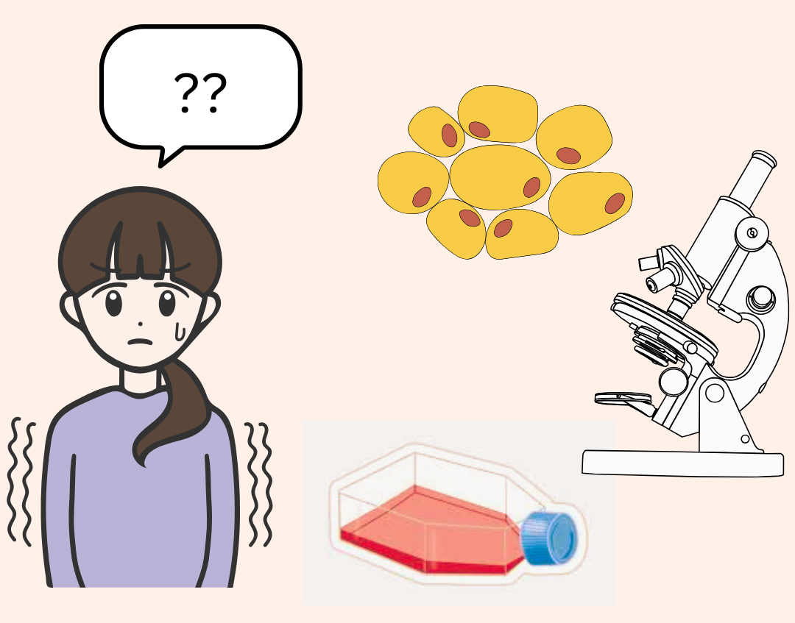
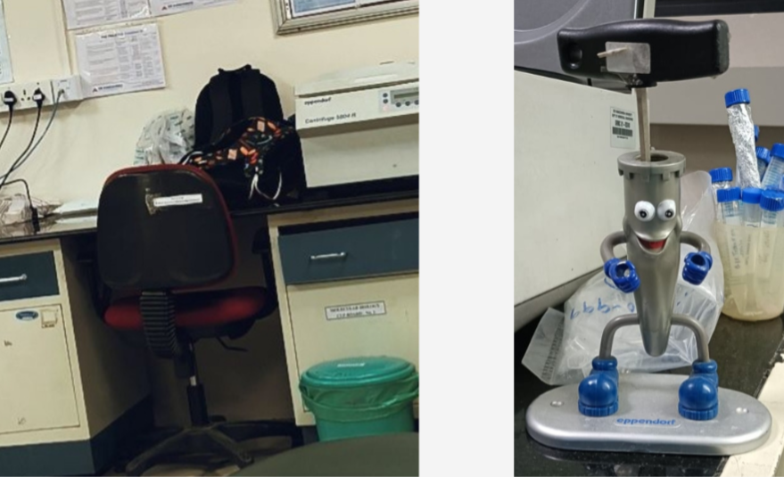

 
# Things I Didn’t Expect to Learn From My Master’s Project
Date: 2025-07-06
## *From Clueless Cultures to Confidence (Kind Of)*
---

We’ve already discussed what happens physically to someone with Parkinson’s. But underneath all that? There's a storm happening in the brain.
Let’s zoom in, shall we? 

The Star of the Show: Dopamine
Dopamine is a chemical messenger in the brain that helps control movement, mood, and even motivation. Think of it as your brain’s “smooth operator.”
In Parkinson’s, dopamine starts to disappear — specifically in a tiny region called the substantia nigra, deep within the midbrain.

<Figure style="text-align: center;">

<figcaption> Me, my cells and absolutely no clue what I'm doing</figcaption>
</figure>

But slowly, I began to get it.
I learned how to handle flasks confidently, how to tell if my media looked off, and how to trust what I was seeing under the microscope.
Each passage taught me something new — not just about the cells but about myself.

## It Wasn’t Just Science — It Was Adaptation
At first, every task felt like a test.
But over time, I began to anticipate what came next — how to plan media changes, manage time in the culture room, organize experiments, and troubleshoot on the fly.

The rigid SOPs turned into flexible workflows.
The girl who didn’t like staying a minute overtime was staying back hours — not because she had to, but because she *wanted* to.

 <Figure style="text-align: center;">

<figcaption> 7:20pm. Everyone left. I stayed. Voluntarily. Who am I? </figcaption>
</figure>

And I realized that research isn’t about memorizing steps — it’s about adapting when the steps don’t go as planned.

## The Emotional Learning Curve
There were moments of panic.
And frustration.
And that one week where everything seemed to go wrong back-to-back.

 <Figure style="text-align: center;">

<figcaption>The place that saw the panic, pep talks and all the existential crisis. Oh and meet Señor Pipette - my emotional support instrument</figcaption>
</figure>

But somewhere between the failures and mini-victories, I became more resilient.
I learned how to be patient when things took longer than expected.
How to stay calm when something didn’t work.
How to be okay with not knowing everything right away.

And that mindset shift?
Probably the biggest win of all.

## Looking Back Now
This project didn’t just teach me about senescence markers or antioxidant effects.
It taught me:

How to work with living systems that don’t always behave as expected.

How to think critically when things don’t go as planned.

How to stay grounded, even when my experiments weren’t.

It made me curious.
Confident.
And most of all, it made me excited to keep learning.

To Anyone Just Starting Out
It’s okay to not know anything when you begin.
What matters is showing up. Asking questions. Trying again.

Your flasks might be quiet, but the growth happening in you is *loud*.
And one day, you’ll realise: you didn’t just finish a project.
You built a whole new version of yourself in the process.

— **Krithika Rajesh** 🧠

