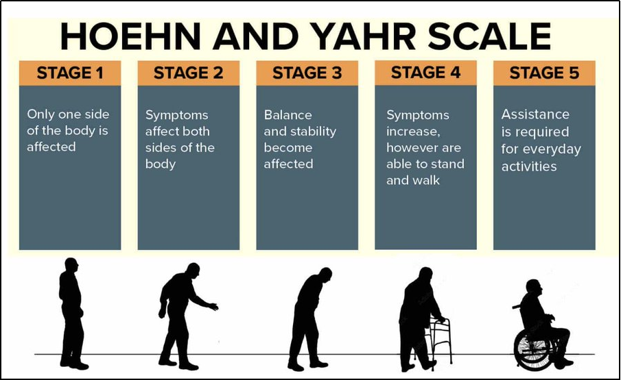
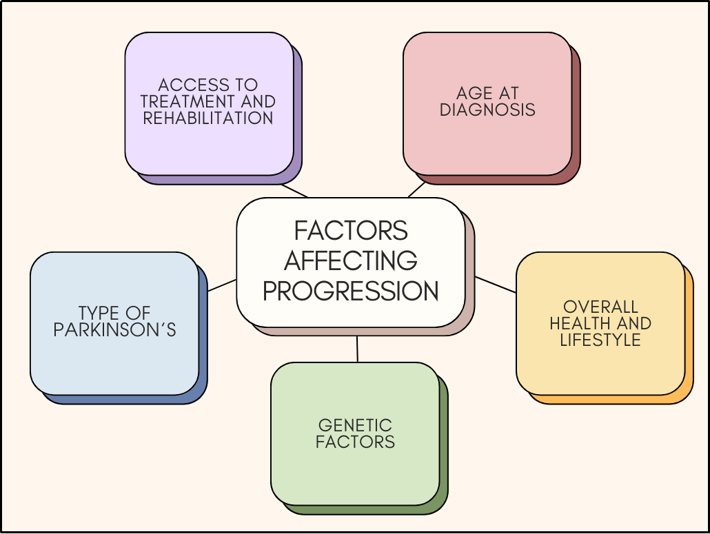

# Progression, Not Perfection 
## The 5 Stages of Parkinson’s Disease

While symptoms like tremors, stiffness, or difficulty walking are part of Parkinson’s, the disease is far more complex, and its progression isn’t the same for everyone. 

The [Hoehn and Yahr scale](https://www.neurology.org/doi/10.1212/WNL.17.5.427), developed in 1967, is one way doctors describe how the disease advances over time. It divides Parkinson’s into five stages, from mild to severe, but these stages are more like general guidelines than a strict timeline.

This blog will break down what each stage can look like regarding **functional abilities, motor vs. non-motor symptoms**, and why no two journeys are identical.

## Stage 1: The Subtle Start
## Functional changes:

* Symptoms are usually mild and may not interfere much with daily life.
* Only one side of the body (unilateral) is affected.
* Most people remain fully independent.
  
## Motor symptoms:

* Slight tremor in one hand or arm.
* Minor changes in posture or facial expression (reduced “facial expressiveness”).
* Slight stiffness or slowness of movement.
  
## Non-motor symptoms:
* Fatigue, mild anxiety, or loss of smell can appear even before motor symptoms.
  
 <Figure style="text-align: center;">

<figcaption> </figcaption>
</figure>

**Fact:** Many people stay in this stage for years, and some don’t even realise these symptoms are related to Parkinson’s at first.

## Stage 2: The Noticeable Shift
## Functional changes:

* Symptoms are now on both sides of the body (bilateral), but balance is still intact.
* Everyday tasks take a bit longer.
* You can still live independently without assistance.
  
## Motor symptoms:
* Tremor, stiffness, and slowness are more noticeable.
* Speech may become softer.
* Walking pattern changes (shorter steps, reduced arm swing).
  
## Non-motor symptoms:
* Mild mood changes.
* Sleep disturbances.
* Some people start noticing constipation or urinary urgency.
  
   <Figure style="text-align: center;">

<figcaption> </figcaption>
</figure>

**Fact:** People often adapt well here, but fatigue and frustration may become part of the routine.

## Stage 3: The Balancing Act
## Functional changes:
* Balance problems begin to appear, increasing the risk of falls.
* Slower movements make tasks like dressing or cooking harder.
* Still independent, but daily life requires more focus and effort.
  
## Motor symptoms:
* Noticeable slowing of movement (bradykinesia).
* Impaired reflexes for balance.
* Tremors may be more constant, but not always severe.
  
## Non-motor symptoms:

* Cognitive changes such as mild memory problems or difficulty multitasking.
* Anxiety and depression may become more prominent.

 <Figure style="text-align: center;">

<figcaption> </figcaption>
</figure>

**Fact:** This is often when Parkinson’s becomes more visible to others. Mobility aids may start being considered.

## Stage 4: The Dependency Stage
## Functional changes:
* Severe motor symptoms make it unsafe to live alone.
* Standing and walking are still possible (sometimes with aids), but independence is greatly reduced.
  
## Motor symptoms:
* Significant stiffness and slowness.
* Severe difficulty turning, getting out of bed, or rising from a chair.
  
## Non-motor symptoms:
* Increased cognitive decline in some individuals.
* Greater challenges with swallowing and speech.
  
 <Figure style="text-align: center;">

<figcaption> </figcaption>
</figure>

**Fact:** Many people in this stage require a caregiver for daily needs, but quality of life can still be improved with the right care, physiotherapy, and adaptive tools.

## Stage 5: The Full Support Stage
## Functional changes:
* Usually confined to a wheelchair or bed unless assisted.
* Requires 24-hour care for all needs.
  
## Motor symptoms:
* Severe stiffness.
* Inability to stand or walk independently.
  
## Non-motor symptoms:
* Hallucinations, severe dementia, or profound fatigue can occur in some patients.
* Pain and discomfort from immobility are common.

**Fact:** While this is the most advanced stage, compassionate care, tailored therapy, and strong emotional support can still bring comfort and dignity

<Figure style="text-align: center;">

<figcaption>Visual representation of the Hoehn and Yahr scale for diagnosing Parkinson’s
</figcaption>
</figure>

## Why Each Journey Is Different

The Hoehn and Yahr scale is useful, but it’s not a stopwatch. Two people can be diagnosed at the same time and follow completely different paths. Some factors influencing progression include:

* [Age](https://pmc.ncbi.nlm.nih.gov/articles/PMC3989046/) at diagnosis
* [Overall health and lifestyle](https://pmc.ncbi.nlm.nih.gov/articles/PMC9463300/)
* [Genetic factors](https://krithikarajesh.github.io/BenchToBrain.github.io/posts/view.html?post=gene.md)
* [Type of Parkinson’s](https://www.parkinsons.org.uk/information-and-support/types-parkinsons) 
* Access to treatments and rehabilitation
  
Some progress slowly over decades; others may experience faster changes. And remember, **non-motor symptoms** like depression, constipation, and sleep disorders can appear years before or independently of motor changes.

<Figure style="text-align: center;">

<figcaption>The major factors that affect the progression of Parkinson’s.</figcaption>
</figure>

## 💡 Key takeaway
Parkinson’s disease is more than its stages. It’s a deeply personal journey shaped by biology, lifestyle, and support systems. While the Hoehn and Yahr scale gives us a roadmap, every road is different, and with research, rehabilitation, and community, living well with Parkinson’s is possible at every stage.

-**Krithika Rajesh 🧠**
